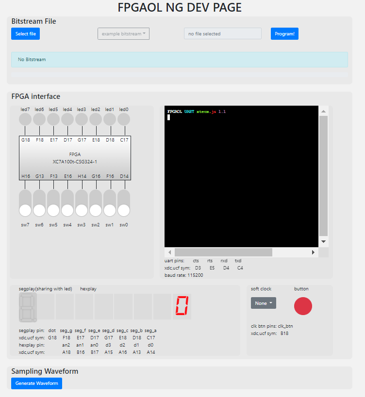
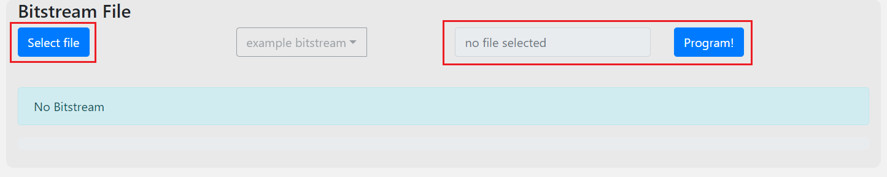
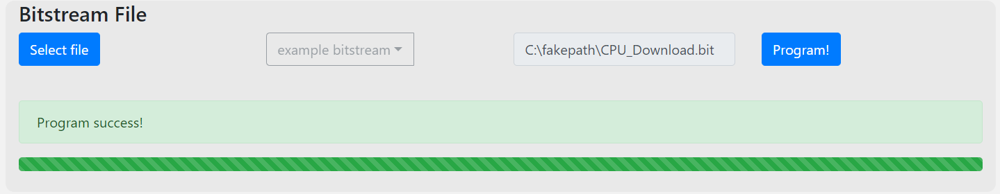
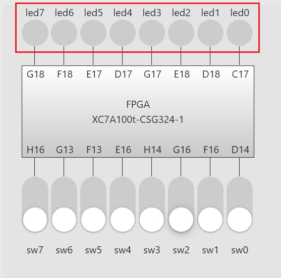
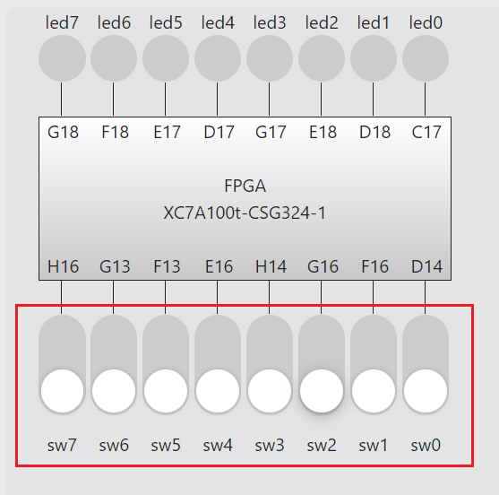
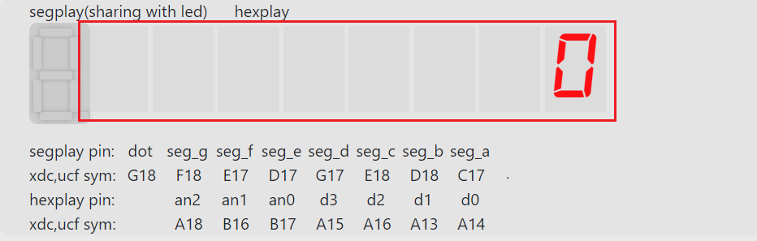
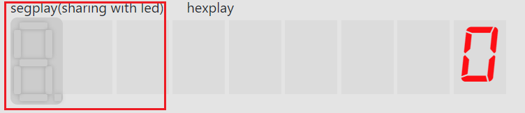
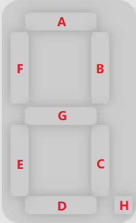
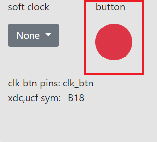

# FPGA烧写教程

（如何选择文件，如何烧写，外设说明（LED，开关，按钮，数码管在哪里，怎么看，还有串口的使用教程））

## 页面介绍

​		点进系统生成的**Panel Link**的URL后，主页面大致如下显示：



## 如何选择文件并烧写

​		下面介绍如何选择文件与烧写文件。烧写出比特流文件后，第一步点击`Select File`按钮，选择所需烧写的后缀为.bit的文件，打开后点击`Program`，即可烧写对应代码生成的文件。



​		出现Program Success即表示烧写成功，如下所示：



​		若出现烧写失败的情况，**可选择文件再烧写一次或是退出Release并重新Acquire一个新板子进行烧写**。

## 外设说明

​		以FPGAOL 1.0为例，FPGAOL中提供的可操作的外设，主要包括**LED**、**Switch**、**Button**、**SegPlay**、**HexPlay**、**串口操作**等等。以下将介绍部分常用的外设。

### LED

​		FPGAOL的LED部分位于如下位置：



​		LED控制的逻辑比较简单，当代码中某时刻led[i]的电平为高时，对应端口的LED灯亮，LED编号与FPGA管脚对应关系为：

| LED  | 0    | 1    | 2    | 3    | 4    | 5    | 6    | 7    |
| ---- | ---- | ---- | ---- | ---- | ---- | ---- | ---- | ---- |
| 管脚 | C17  | D18  | E18  | G17  | D17  | E17  | F18  | G18  |

​		对应管脚约束文件[fpgaol1.xdc](https://fpgaol.ustc.edu.cn/download/fpgaol1.xdc)中的如下部分：

```
## FPGAOL LED (signle-digit-SEGPLAY)

#set_property -dict { PACKAGE_PIN C17   IOSTANDARD LVCMOS33 } [get_ports { led[0] }];
#set_property -dict { PACKAGE_PIN D18   IOSTANDARD LVCMOS33 } [get_ports { led[1] }];
#set_property -dict { PACKAGE_PIN E18   IOSTANDARD LVCMOS33 } [get_ports { led[2] }];
#set_property -dict { PACKAGE_PIN G17   IOSTANDARD LVCMOS33 } [get_ports { led[3] }];
#set_property -dict { PACKAGE_PIN D17   IOSTANDARD LVCMOS33 } [get_ports { led[4] }];
#set_property -dict { PACKAGE_PIN E17   IOSTANDARD LVCMOS33 } [get_ports { led[5] }];
#set_property -dict { PACKAGE_PIN F18   IOSTANDARD LVCMOS33 } [get_ports { led[6] }];
#set_property -dict { PACKAGE_PIN G18   IOSTANDARD LVCMOS33 } [get_ports { led[7] }];
```

### Switch

​		FPGAOL的sw部分位于如下位置：



​		sw是FPGAOL常用的输入控制方式，在默认情况下，`sw[7:0]`的输入初始均为低电平(0)，当点击某个sw时，便可以调整输入。

​		sw编号与FPGA管脚对应关系为：

| Sw   | 0    | 1    | 2    | 3    | 4    | 5    | 6    | 7    |
| ---- | ---- | ---- | ---- | ---- | ---- | ---- | ---- | ---- |
| 管脚 | C17  | D18  | E18  | G17  | D17  | E17  | F18  | G18  |

​		对应管脚约束文件[fpgaol1.xdc](https://fpgaol.ustc.edu.cn/download/fpgaol1.xdc)中的如下部分：

```
## FPGAOL SWITCH

#set_property -dict { PACKAGE_PIN D14   IOSTANDARD LVCMOS33 } [get_ports { sw[0] }];
#set_property -dict { PACKAGE_PIN F16   IOSTANDARD LVCMOS33 } [get_ports { sw[1] }];
#set_property -dict { PACKAGE_PIN G16   IOSTANDARD LVCMOS33 } [get_ports { sw[2] }];
#set_property -dict { PACKAGE_PIN H14   IOSTANDARD LVCMOS33 } [get_ports { sw[3] }];
#set_property -dict { PACKAGE_PIN E16   IOSTANDARD LVCMOS33 } [get_ports { sw[4] }];
#set_property -dict { PACKAGE_PIN F13   IOSTANDARD LVCMOS33 } [get_ports { sw[5] }];
#set_property -dict { PACKAGE_PIN G13   IOSTANDARD LVCMOS33 } [get_ports { sw[6] }];
#set_property -dict { PACKAGE_PIN H16   IOSTANDARD LVCMOS33 } [get_ports { sw[7] }];
```

### Hexplay

​		FPGAOL的Hexplay的部分位于如下位置：



​		Hexplay部分引入了8个七段数码管，每个七段数码管通过`hexplay_data[3:0]`与`hexplay_an[2:0]`控制输出。`hexplay_data[3:0]`为输出16进制值的大小，`hexplay_an[2:0]`为二进制对应输出的数位，类似C语言中的`Hexplay[hexplay_an] = hexplay_data`。**例如**，若`hexplay_an=3'b010, hexplay_data=4'b1010`，则在下标为2的数位上显示`A`。上述图示为`hexplay_an=3'b000, hexplay_data=4'b0000`的初始情况。

​		若需要多个七段数码管进行显示，通过轮询扫描的方式可以逐个显示每个数码管的值。扫描频率较高时，在视觉上近似于同时显示多个七段数码管。和现实中的数码管一样，我们建议的扫描频率为**50Hz**，也就是说，若要驱动8个数码管，需要一个**400Hz**的时钟。

​		`hexplay_data`和`hexplay_an`与FPGA管脚对应关系为：

| D0   | D1   | D2   | D3   | AN0  | AN1  | AN2  |
| ---- | ---- | ---- | ---- | ---- | ---- | ---- |
| A14  | A13  | A16  | A15  | B17  | B16  | A18  |

​		对应管脚约束文件[fpgaol1.xdc](https://fpgaol.ustc.edu.cn/download/fpgaol1.xdc)中的如下部分：

```
## FPGAOL HEXPLAY

#set_property -dict { PACKAGE_PIN A14   IOSTANDARD LVCMOS33 } [get_ports { hexplay_data[0] }];
#set_property -dict { PACKAGE_PIN A13   IOSTANDARD LVCMOS33 } [get_ports { hexplay_data[1] }];
#set_property -dict { PACKAGE_PIN A16   IOSTANDARD LVCMOS33 } [get_ports { hexplay_data[2] }];
#set_property -dict { PACKAGE_PIN A15   IOSTANDARD LVCMOS33 } [get_ports { hexplay_data[3] }];
#set_property -dict { PACKAGE_PIN B17   IOSTANDARD LVCMOS33 } [get_ports { hexplay_an[0] }];
#set_property -dict { PACKAGE_PIN B16   IOSTANDARD LVCMOS33 } [get_ports { hexplay_an[1] }];
#set_property -dict { PACKAGE_PIN A18   IOSTANDARD LVCMOS33 } [get_ports { hexplay_an[2] }];
```

### Segplay

​		FPGAOL的segplay(八段数码管)部分位于如下位置:



​		SegPlay的显示方式与Hexplay不同，为了弥补hex_play不能按段来显示数字的缺陷，我们提供了seg_play，它是支持通过段来控制的一位数码管。为了节约管脚，它的控制信号是与LED共享的，可以通过LED的信号来控制它，Segplay对应LED与管脚如下所示：

| 数码管 | A    | B    | C    | D    | E    | F    | G    | H(点) |
| ------ | ---- | ---- | ---- | ---- | ---- | ---- | ---- | ----- |
| LED    | 0    | 1    | 2    | 3    | 4    | 5    | 6    | 7     |
| 管脚   | C17  | D18  | E18  | G17  | D17  | E17  | F18  | G18   |

​		每个LED对应的数码管段如下所示：



​		

### Button

​		FPGAOL的button的部分位于如下位置：



​		该按钮在**按下时为高电平，松开时为低电平**，该btn对应管脚**B18**。

​		对应管脚约束文件[fpgaol1.xdc](https://fpgaol.ustc.edu.cn/download/fpgaol1.xdc)中的如下部分：

```
## FPGAOL BUTTON & SOFT_CLOCK

#set_property -dict { PACKAGE_PIN B18   IOSTANDARD LVCMOS33 } [get_ports { btn }];
```


