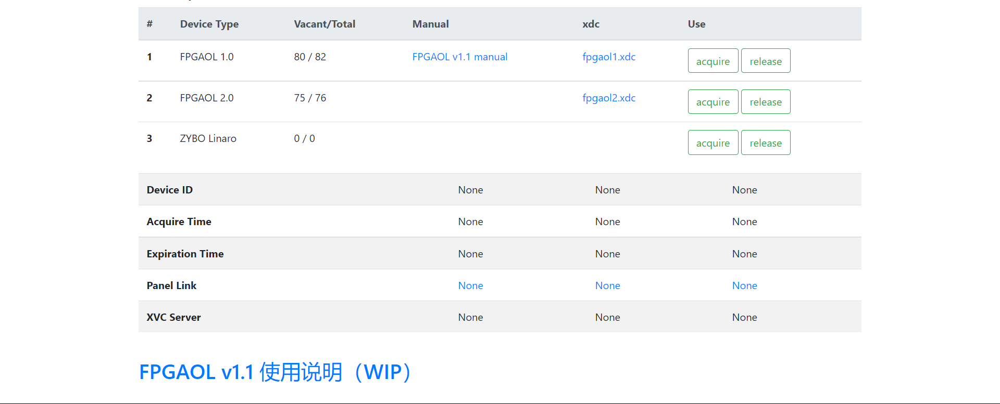
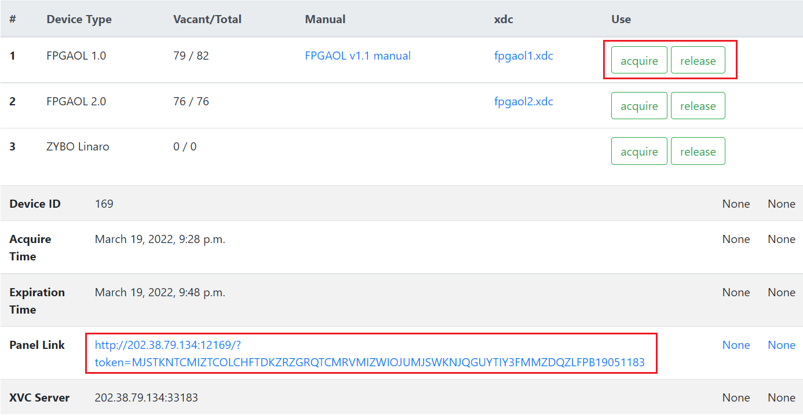
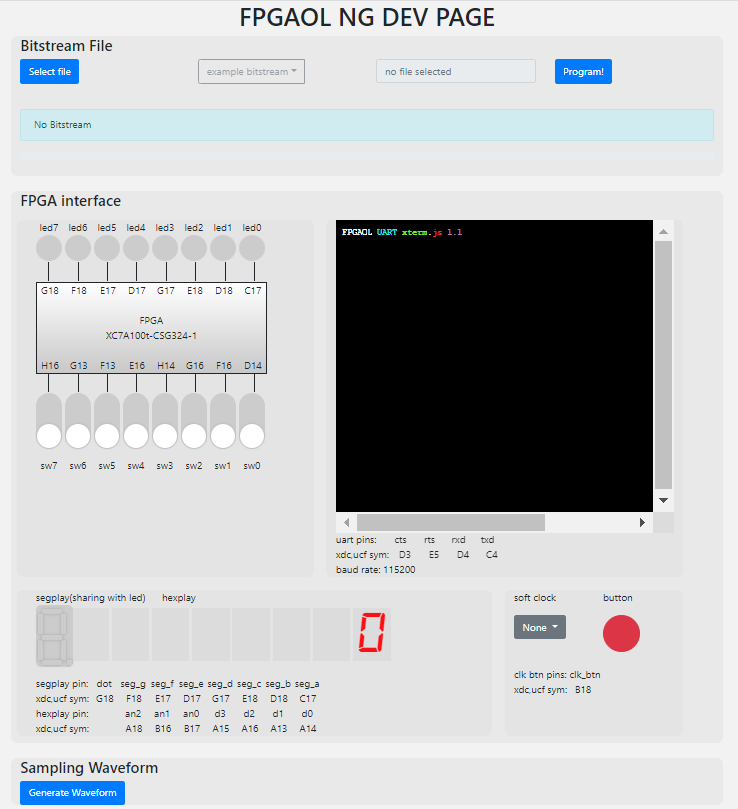
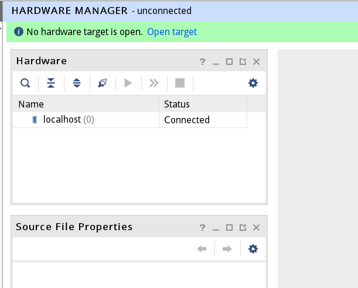
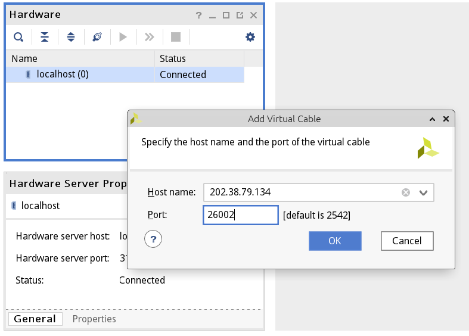
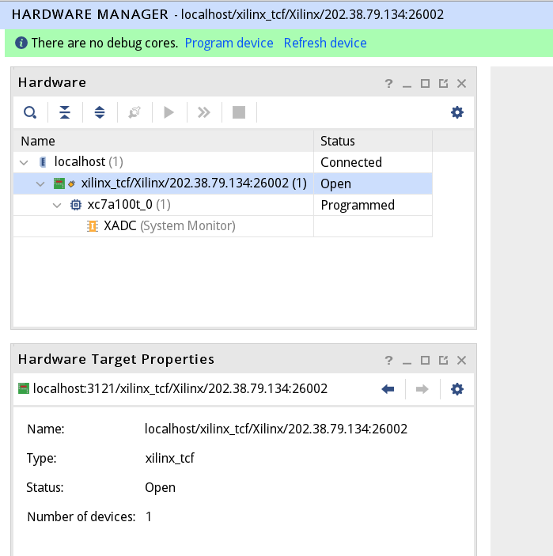

#  平台的使用教程

## FPGAOL页面

​		在浏览器中，您可以通过两种方式进入FPGAOL页面：

- 通过打开网址https://fpgaol.ustc.edu.cn/fpga/usage/直接进入FPGAOL页面
- 通过VLAB页面https://vlab.ustc.edu.cn/，点击FPGA在线，即可进入FPGAOL页面

## 如何申请一个FPGA

​		FPGAOL页面提供了随时随地动态申请FPGA结点的功能。目前用户可申请的在线结节点一共有两种类型，分别为**FPGAOL 1.0**与**FPGAOL 2.0**。根据需求，用户可以点击对应结点右侧Use条目下的`acquire`进行FPGA节点的申请，点击申请后稍等片刻页面将给出资源的访问链接。

​		以FPGAOL 1.0为例，点击`acquire`后所生成的**Panel Link**即为所申请的网络资源节点的URL。

## 如何进入FPGA

​		点击**Panel Link**后的URL，即可操作所申请的FPGA结点。

点击进入后的页面应如下所示：

## 如何释放一个FPGA

​		目前用户每次使用FPGA资源的时间默认为**20分钟**，超时后即被释放，用户也可以通过首页的`release`按钮主动释放FPGA。

## （进阶）如何使用 XVC

​		目本功能处于试验状态，目前对校内同学开放。

统一身份认证后获取一代 FPGA 节点，可以看到面板上 XVC Server 处获得了一个地址和有效（大于 0）端口，一般该端口和用户绑定，不会变化。

在 VLAB 或自己电脑的 Vivado 中，首先 Open Hardware Manager，并点击 Open target -- Auto Connect。在没有物理设备连接时会显示如下：

此时，在 localhost 处右键，点击 Add Xilinx Virtual Cable(XVC)... ，会弹出提示输入主机地址和端口：

输入 FPGAOL 页面上的地址和端口，确认**已经获取 FPGA 并网络良好**，点击 OK，稍等后如果一切无误，将看到成功添加了 XVC 设备，并看到了 FPGAOL 平台板子上的 xc7a100t FPGA 芯片，就和板子直接通过 USB 连在自己电脑上一样。

此时可以和往常一样进行比特流烧写，烧写后 FPGAOL 网页端**仍然会实时更新硬件状态，无需担心不同步的问题**。

如果成功连接了 XVC 但上图中的 Status 显示为 Closed，只要右键点击并选择 Open Target 即可。

当 FPGA 超时释放或被用户释放时，XVC 连接将立即中断。如果申请新的 FPGA，在 Vivado 中**无需任何操作**，新的 FPGA 会自动连接上来，较为方便。

如果遇到问题，可以尝试**关闭 Hardware Manager 并重新打开，VLAB 上可以尝试 `pkill hw_server`**。仍有问题请与管理员联系。

## （进阶）使用 ILA

能够直接通过 XVC 连接 FPGA 的一大好处是可以使用在线逻辑分析仪（ILA）直接在运行时抓取 FPGA 设计中内部的信号。

关于 ILA 的介绍，可以参考 [**此 LUG 小聚视频**](https://ftp.lug.ustc.edu.cn/weekly_party/2020.12.13_%E6%97%A0%E4%B8%BB%E9%A2%98%E5%B0%8F%E8%81%9A/Video/4.mp4)。在新的示例中，也有最简单的 ILA 使用（在 Vivado XVC 烧写比特流时，选中 .bit 文件，会自动识别同名的 .ltx 调试文件）。