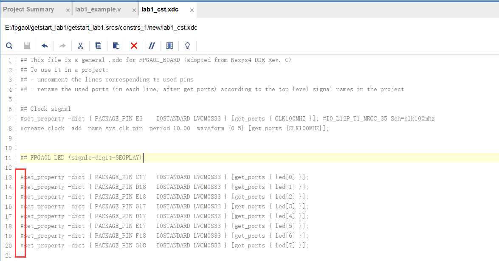

# 让灯亮起来

## Introduction

​		在这个入门实验中，我们最终要实现的效果是通过控制sw按钮来使led亮起来，具体的sw与led的对应关系由我们编程控制。下面是一种常见的对应关系：

| sw0  | sw1  | sw2  | sw3  | sw4  | sw5  | sw6  | sw7  |
| :--: | :--: | :--: | :--: | :--: | :--: | :--: | :--: |
| led0 | led1 | led2 | led3 | led4 | led5 | led6 | led7 |

## step1：创建工程

1. 在vivado通过 `Create Project` 新建工程：


2. 接下来一直点 `Next` 直到如下界面：


3. 在Search中输入 `xc7a100tcsg324-1` 选择芯片型号：


4. 接着点 `Next` 直到点击 `finish`

​		工程新建成功可以看到如下界面：


## step2：写设计文件

1. 点击左侧栏中的 `Add Source` 新建设计文件：

2. 点击 `Next` 后点击图中 `Create File` ：


3. 命名后点击`Finish`，点击`OK`，点击`Yes`，之后可以看到设计文件创建成功：


4. 编辑设计文件，输入如下代码：

```verilog
//以下代码就是将sw赋值给led，但要注意是sw从低到高位赋给led从高到低位！
module lab1_example(
input            clk,
input            rst,
input      [7:0]  sw,
output reg [7:0] led
    );

always@(posedge clk or posedge rst)
begin
    if(rst)
        led <= 8'h00;
    else
        led <= {sw[0], sw[1], sw[2], sw[3], sw[4], sw[5], sw[6], sw[7]};
end

endmodule
```

## step3：写约束文件

1. 添加约束文件：


2. 创建成功后，如下：


3. 用[About - FPGA Online (ustc.edu.cn)](https://fpgaol.ustc.edu.cn/fpga/usage/)上的xdc模板填充约束文件，点击图中位置即可下载模板：


4. 将约束文件中我们需要的部分去注释(即去除行起始的’#‘)：



5. 接下来对约束文件需要修改的地方做出一些解释。

   ​	输入时钟信号，红框中的变量名就是我们设计文件中的时钟输入信号名


​			输入复位信号，红框中的变量名就是设计文件中的复位输入信号名，对应着fpgaol上的红色 `button`


​			输入sw信号，红框中的变量名就是设计文件中的sw输入信号，对应着fpgaol上的 `sw7-0`


​			输出led信号，红框中的变量就是设计文件中的led输出信号，对应着fpgaol上的 `led7-0`


​			关于 `PACKAGE_PIN` 与fpgaol按钮的对照图如下：	

| LED  | 0    | 1    | 2    | 3    | 4    | 5    | 6    | 7    |
| ---- | ---- | ---- | ---- | ---- | ---- | ---- | ---- | ---- |
| 管脚 | C17  | D18  | E18  | G17  | D17  | E17  | F18  | G18  |

| Sw   | 0    | 1    | 2    | 3    | 4    | 5    | 6    | 7    |
| ---- | ---- | ---- | ---- | ---- | ---- | ---- | ---- | ---- |
| 管脚 | D14  | F16  | G16  | H14  | E16  | F13  | G13  | H16  |

至此，约束文件的需要修改的地方就完了

## step4：烧写上板

1. 点击左侧栏最下方的 `Generate Bitstream` 进行烧写


2. 如果烧写成功会看到如下界面，点击 `Cancel`

   

3. `/project_name/project_name.runs/impl_1/design_file_name.bit` 就是我们要的bit文件

4. 将该bit文件上传到fpgaol平台进行烧写，烧写具体流程请看[fpgaol使用教程/最快上手---最快烧写流程.md · main · hexu / fpgaol_document · GitLab (ustc.edu.cn)](https://git.lug.ustc.edu.cn/hexu/fpgaol_document/-/blob/main/fpgaol使用教程/最快上手---最快烧写流程.md)

5. 接下来就可以通过按sw观察led了！

   

   根据设计文件和约束文件，我们可以知道所写代码的对应关系是如下的

| sw0  | sw1  | sw2  | sw3  | sw4  | sw5  | sw6  | sw7  |
| :--: | :--: | :--: | :--: | :--: | :--: | :--: | :--: |
| led7 | led6 | led5 | led4 | led3 | led2 | led1 | led0 |

​		上图结果符合预期！

经过本次实验，你应该大致了解了通过vivado和fpgaol协同开发的流程！

