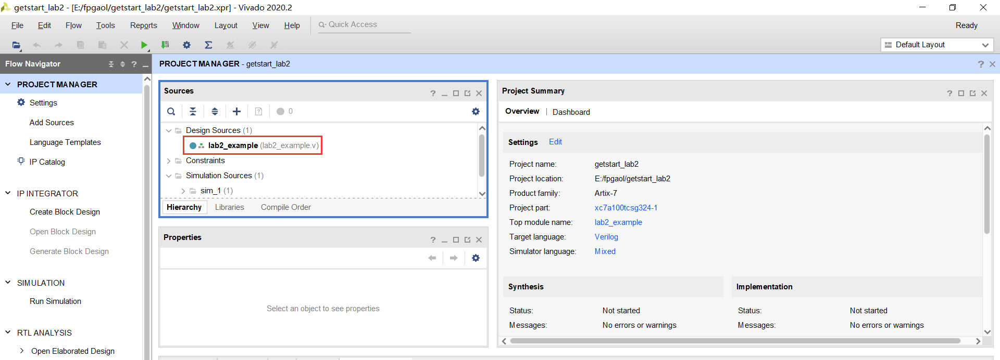
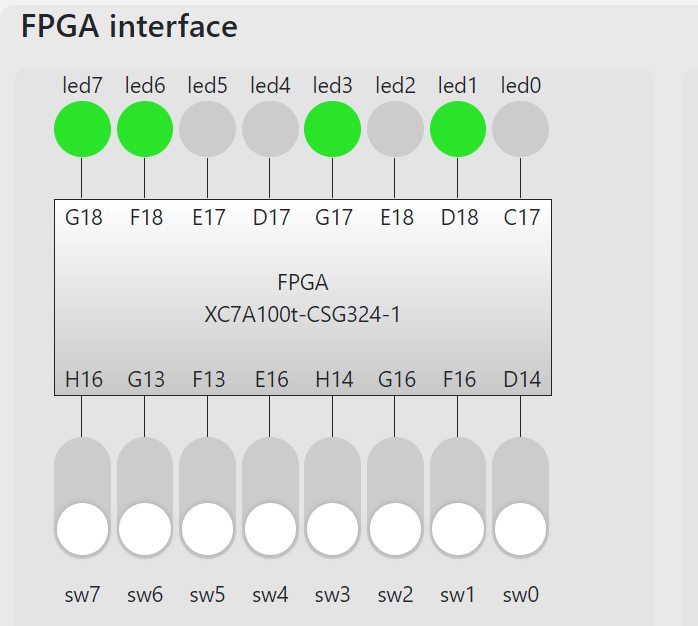
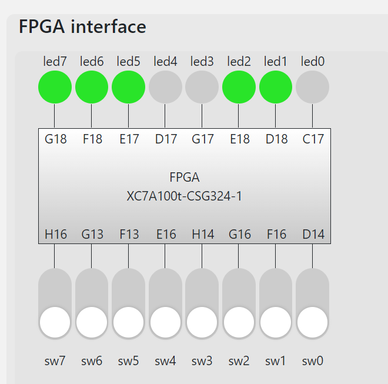

# 简单的计数器

## Introduction

​		在本篇文章中，我们的实验目的是编程完成一个计数器，并将其可视化在 `fpgaol` 平台上，以便大家对时钟特性以及 `Verilog`编程有更深的理解。

​		实验平台提供了一个全局时钟信号，具体实现如下：FPGAOL实验平台的开发板上有一个 `100MHz` 的时钟晶振，该晶振与 FPGA 芯片的 E3 管脚直接相连，在开发板上电后，会持续的为 FPGA 芯片提供一个 `100MHz` 频率的时钟信号。

​		接下来的我们将设计一个 30 位计数器，每个时钟周期加 1，用右侧的 8 个 LED 表示计数器的高 8 位，观察实际运行结果

## step1：创建工程

​		`Vivado` 工程的创建过程可参考实验1，成功创建后应该能看到如下界面：



## step2：Verilog代码

​		根据实验目标，我们可以写出如下代码：

```verilog
module lab2_example(
input clk,
input rst,
input [7:0] sw,
output reg [7:0] led
    );

//30bit 计时器
reg [29:0] count;

always@(posedge clk or posedge rst)
begin
    if(rst || count == 30'h3fff_ffff)	//手动rst或自动达上限归零
        count <= 30'h0;
    else
        count <= count + 30'h1;			//每个时钟周期加1	
    
    //将高8位通过led显示
    led <= {count[29], count[28], count[27], count[26], count[25], count[24], count[23], count[22]};
end    

endmodule

```

## step3：约束文件

​		约束文件模板的获取方法实验一已经提到，以下是这个实验的约束文件配置：

```verilog
## This file is a general .xdc for FPGAOL_BOARD (adopted from Nexys4 DDR Rev. C)
## To use it in a project:
## - uncomment the lines corresponding to used pins
## - rename the used ports (in each line, after get_ports) according to the top level signal names in the project

## Clock signal
set_property -dict { PACKAGE_PIN E3    IOSTANDARD LVCMOS33 } [get_ports { clk }]; #IO_L12P_T1_MRCC_35 Sch=clk100mhz
#create_clock -add -name sys_clk_pin -period 10.00 -waveform {0 5} [get_ports {CLK100MHZ}];


## FPGAOL LED (signle-digit-SEGPLAY)

set_property -dict { PACKAGE_PIN C17   IOSTANDARD LVCMOS33 } [get_ports { led[0] }];
set_property -dict { PACKAGE_PIN D18   IOSTANDARD LVCMOS33 } [get_ports { led[1] }];
set_property -dict { PACKAGE_PIN E18   IOSTANDARD LVCMOS33 } [get_ports { led[2] }];
set_property -dict { PACKAGE_PIN G17   IOSTANDARD LVCMOS33 } [get_ports { led[3] }];
set_property -dict { PACKAGE_PIN D17   IOSTANDARD LVCMOS33 } [get_ports { led[4] }];
set_property -dict { PACKAGE_PIN E17   IOSTANDARD LVCMOS33 } [get_ports { led[5] }];
set_property -dict { PACKAGE_PIN F18   IOSTANDARD LVCMOS33 } [get_ports { led[6] }];
set_property -dict { PACKAGE_PIN G18   IOSTANDARD LVCMOS33 } [get_ports { led[7] }];


## FPGAOL SWITCH

set_property -dict { PACKAGE_PIN D14   IOSTANDARD LVCMOS33 } [get_ports { sw[0] }];
set_property -dict { PACKAGE_PIN F16   IOSTANDARD LVCMOS33 } [get_ports { sw[1] }];
set_property -dict { PACKAGE_PIN G16   IOSTANDARD LVCMOS33 } [get_ports { sw[2] }];
set_property -dict { PACKAGE_PIN H14   IOSTANDARD LVCMOS33 } [get_ports { sw[3] }];
set_property -dict { PACKAGE_PIN E16   IOSTANDARD LVCMOS33 } [get_ports { sw[4] }];
set_property -dict { PACKAGE_PIN F13   IOSTANDARD LVCMOS33 } [get_ports { sw[5] }];
set_property -dict { PACKAGE_PIN G13   IOSTANDARD LVCMOS33 } [get_ports { sw[6] }];
set_property -dict { PACKAGE_PIN H16   IOSTANDARD LVCMOS33 } [get_ports { sw[7] }];


## FPGAOL HEXPLAY

#set_property -dict { PACKAGE_PIN A14   IOSTANDARD LVCMOS33 } [get_ports { hexplay_data[0] }];
#set_property -dict { PACKAGE_PIN A13   IOSTANDARD LVCMOS33 } [get_ports { hexplay_data[1] }];
#set_property -dict { PACKAGE_PIN A16   IOSTANDARD LVCMOS33 } [get_ports { hexplay_data[2] }];
#set_property -dict { PACKAGE_PIN A15   IOSTANDARD LVCMOS33 } [get_ports { hexplay_data[3] }];
#set_property -dict { PACKAGE_PIN B17   IOSTANDARD LVCMOS33 } [get_ports { hexplay_an[0] }];
#set_property -dict { PACKAGE_PIN B16   IOSTANDARD LVCMOS33 } [get_ports { hexplay_an[1] }];
#set_property -dict { PACKAGE_PIN A18   IOSTANDARD LVCMOS33 } [get_ports { hexplay_an[2] }];

## FPGAOL BUTTON & SOFT_CLOCK

set_property -dict { PACKAGE_PIN B18   IOSTANDARD LVCMOS33 } [get_ports { rst }];

##USB-RS232 Interface

#set_property -dict { PACKAGE_PIN C4    IOSTANDARD LVCMOS33 } [get_ports { UART_TXD_IN }]; #IO_L7P_T1_AD6P_35 Sch=uart_txd_in
#set_property -dict { PACKAGE_PIN D4    IOSTANDARD LVCMOS33 } [get_ports { UART_RXD_OUT }]; #IO_L11N_T1_SRCC_35 Sch=uart_rxd_out
#set_property -dict { PACKAGE_PIN D3    IOSTANDARD LVCMOS33 } [get_ports { UART_CTS }]; #IO_L12N_T1_MRCC_35 Sch=uart_cts
#set_property -dict { PACKAGE_PIN E5    IOSTANDARD LVCMOS33 } [get_ports { UART_RTS }]; #IO_L5N_T0_AD13N_35 Sch=uart_rts
```

## step4：烧写并运行！

​		用 `Generate Bitstream` 产生bit文件，并将其在 FPGAOL 平台上运行，我们就可以看到计时器了。显示在平台上的计数间隔应该是$10^{-8}s*2^{22}$，通过合理的设计与扩展，就可以得到具有给定计时单位的计时器！





