# FPGAOL实例实验——button的使用

## 实验目的

- 信号去毛刺与取边沿

- 学习使用FPGAOL平台的btn按钮

  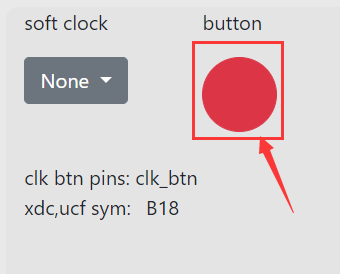


## 实验环境

- FPGAOL：`fpgaol.ustc.edu.cn`
- Vivado


## 实验过程

### Step1. 信号整形及去毛刺

​		在用FPGA开发板的按键或开关作为输入时，由于其机械特性，在点平转换的瞬间会产生一些毛刺，这些毛刺在用户看来非常短暂，但在100MHz的时钟信号下会持续多个周期。以button为例，外面希望按键按下后输入信号会直接从0变为1，按键松开时会直接从1变为0，但实际情况却并非如此，如下图所示：

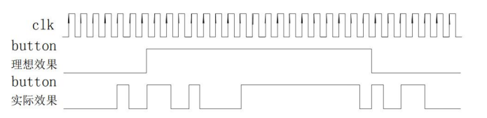

​		我们希望按键按下后不会出现毛刺，遗憾的是，对于这种机械式 的按键来说，毛刺很难完全避免，因此我们需要借助额外的整形电路 来达到消除毛刺的目的。

​		消除毛刺的关键在于区分有效的按键输入和按键按下或抬起瞬间 的机械抖动。以人的反应速度来看，按键按下再抬起，最快也在毫秒 以上量级，而抖动一般都在微秒甚至纳秒量级，因此我们可以通过信 号电平持续时间的长短来判定是否为一次有效按键。通过一个计数器 对高电平持续时间进行计时，当按键输入信号为 0 时，计数器清零， 当输入信号为高电平时，计数器进行累加计数，计数达到阈值后则停 止计数，如下面代码所示：

```verilog
module jitter_clr(
	input clk,
	input button,
	output button_clean
);
	reg [3:0] cnt;
	always@(posedge clk)
	begin
		if(button==1'b0)
			cnt <= 4'h0;
		else if(cnt<4'h8)
			cnt <= cnt + 1'b1;
	end
	assign button_clean = cnt[3];
endmodule
```

​		通过仿真我们发现上述电路能够将持续时间少于 8 个时钟周期的 信号毛刺全部滤除，输出变成了一个较为干净的电平信号。我们还可 以通过调节计数器的阈值改变该电路的精度。

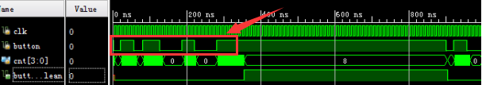

### Step2. 取信号边沿技巧

​		很多场景下，我们希望当按下button时电路状态发生改变，就像是信号的边沿触发电路一样，一般的做法是通过下面的代码来实现状态跳转：

```verilog
always@(posedge clk)
    if(控制信号==1) //控制信号可以是button或其他开关
		//状态跳转
	else
		//状态保持
```

​		但是当上述控制信号的持续时间覆盖了多个时钟上升沿，就会导致电路状态多次跳转。在始终频率较高的情况下，要求用户通过按键、开关这类外设精确输入一个时钟周期的信号显然是不现实的，因为用户的反应时间相对于100MHz的时钟来说太慢了，一次按键可能会持续许多甚至上千万个周期，如下图所示：

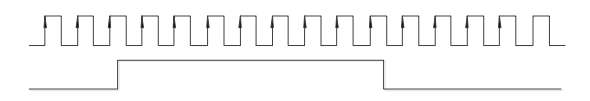

​		下面介绍如何通过该按键信号生成一个时钟周期宽度的脉冲。

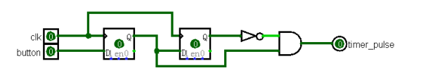

​		通过两个寄存器对输入信号进行寄存，寄存器后的信号分别为 button_r1,button_r2，然后将 button_r2 取反并和 button_r1 进行 与操作，便得到了一个时钟周期宽度的脉冲信号，该信号在 button 信号的上升沿附近为高电平，其余时间均为低电平。具体信号如下图所示：

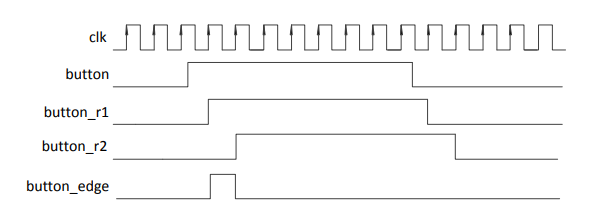

其Verilog代码如下：

```verilog
module signal_edge(
	input clk,
	input button,
	output button_edge
);
	reg button_r1,button_r2;
	always@(posedge clk)
 		button_r1 <= button;
	always@(posedge clk)
 		button_r2 <= button_r1;
	assign button_edge = button_r1 & (~button_r2);
endmodule
```

### Step3. FPGAOL中button的实际应用

​		在Vivado中建立工程，选定FPGA型号，并加入Verilog设计文件和XDC约束文件，经过综合、实现、布局布线等一系列过程后，会生成一种后缀为bit的配置文件，将其烧写到FPGAOL上就可以实现具体功能。下面通过一个实际例子练习：使用button控制LED灯的亮暗。

​		首先新建一个 Vivado 工程，建立工程时，应确保选择的芯片型号 的“xc7a100tcsg324-1”（通过“parts”或“boards”都可以）。

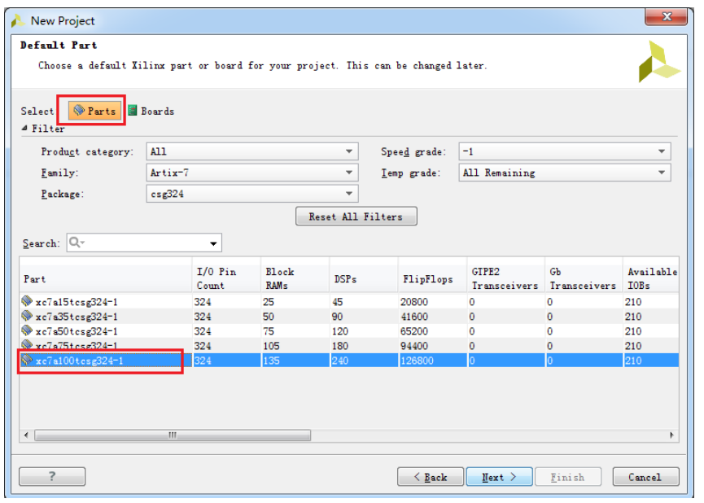

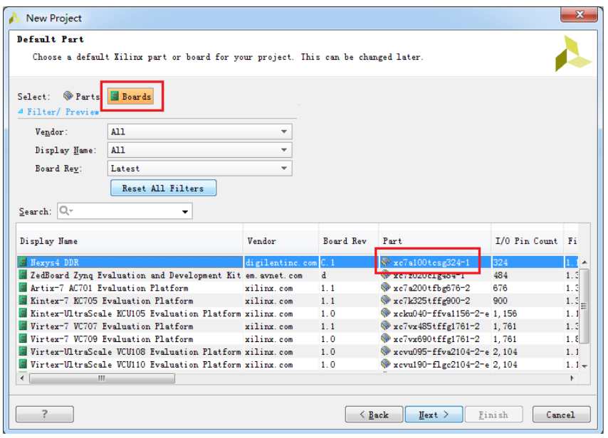

​		接着，我们创建设计文件，如下图所示：

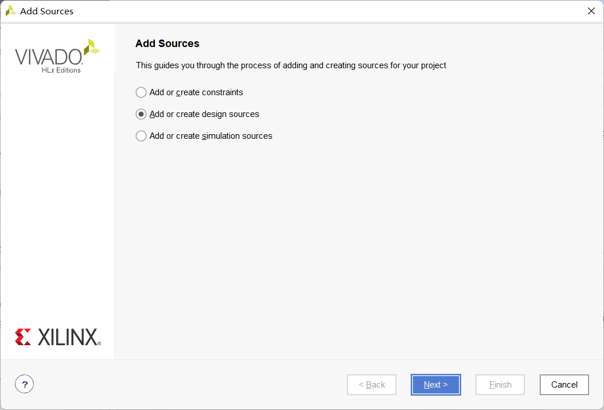

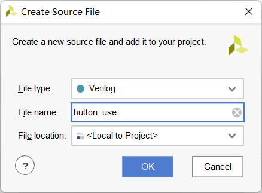

​		接着，开始在设计文件中写入Verilog设计代码：

```verilog
module button_use(
    input   clk,
    input   rst,
    input   button,
    input   [6:0] sw,
    output  reg  [7:0]   led
    );
    reg button_r1,button_r2;
    wire button_edge;
	always@(posedge clk)
 		button_r1 <= button;
	always@(posedge clk)
 		button_r2 <= button_r1;
	assign button_edge = button_r1 & (~button_r2);
    always@(posedge clk or posedge rst)
    begin
        if(rst || button)
            led <= 8'h10101010;
        else
        begin
            led <= {sw[0], sw[1], sw[2], sw[3], sw[4], sw[5], sw[6], 1'b0};
        end          
    end
endmodule
```

​		然后在工程中加入约束文件，如下图所示，点击“Add source”，选 择“Add or create constraints”。

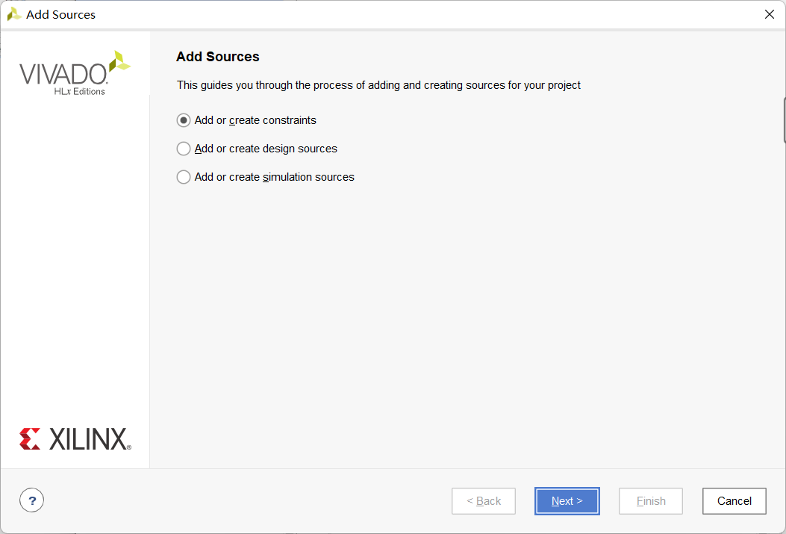

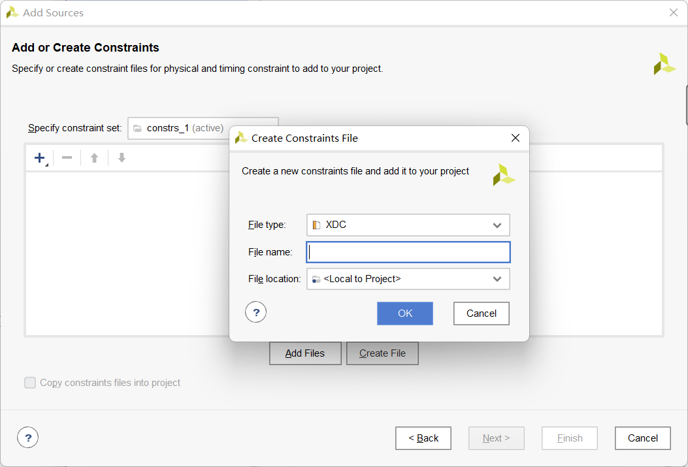

​		为了使用FPGAOL的管脚，我们可以先在FPGAOL平台上下载xdc文件，如下图所示：

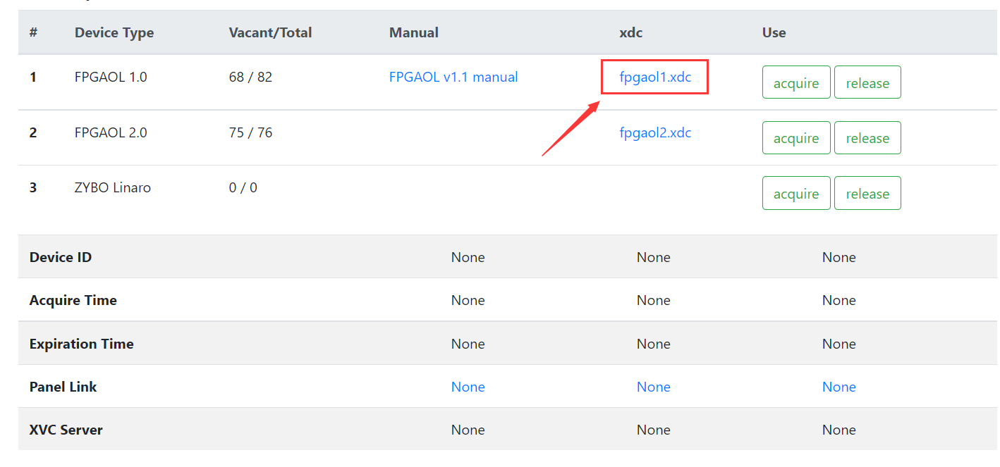

​		之后，对所下载的xdc文件进行改写。可以看出，管脚约束文件语法非常简单，“PACKAGE_PIN”后面跟的是 FPGA 芯片的管脚编号，“get_ports”后面跟的是 Verilog 设计文件顶层模块的端口信号。通过该文件，模块的端口信号便与 FPGA 管脚一一对应起来了。

​		去掉对所需使用的管脚的注释，填入自己设计文件代码中的端口信号名称，如下图所示：

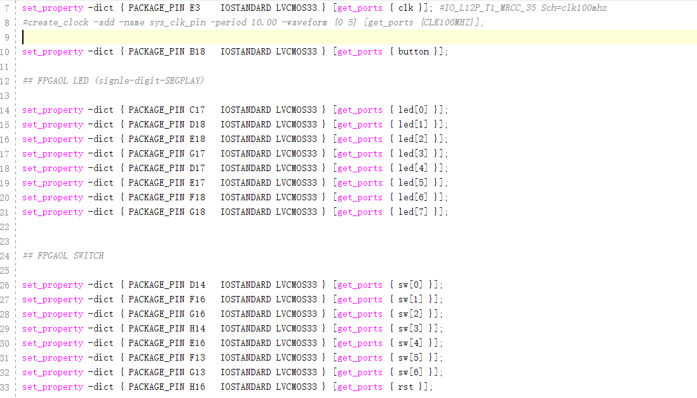

​		可以根据需要将管脚命名为自己所需要的信号，比如这里将第七个sw设置为复位键。

​		完成代码和约束文件输入后，保存工程，并点击“Generate  Bitstream”，Vivado 工具会自动完成综合、实现、布局布线等过程， 并最终生成 bit 文件，生成的 bit 文件一般存放在“工程目录/工程 名.runs/impl_1/”内。选择“取消”按钮关闭弹出的对话框。


​		下面对刚刚得到的bit文件烧写到FPGAOL上。通过"select file"选择刚刚生成的bit文件，然后点击"Program"， 当显示"Program success"时便已经烧写完成。

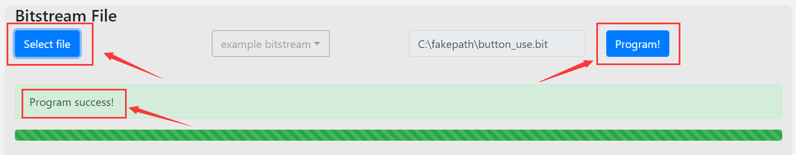

​		接下来，我们看一下运行的具体效果。

​		当拨动开关时，led灯会出现相应的变化：

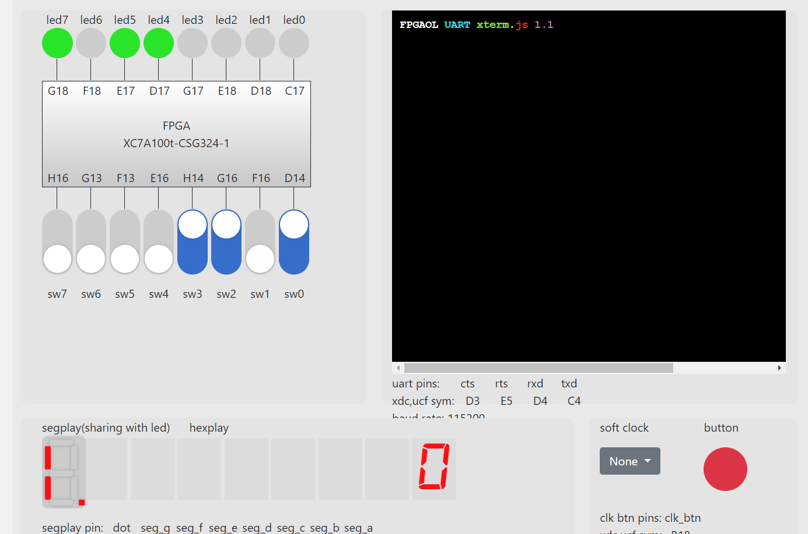
		当拨动复位键时，led灯显示复位状态：

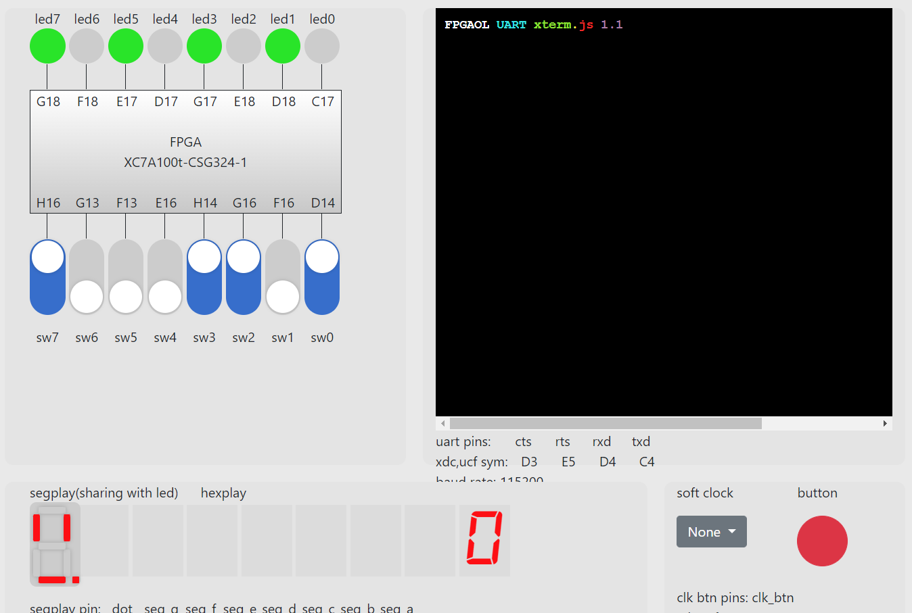

​		当点击button时，led等仍然可以显示复位状态：

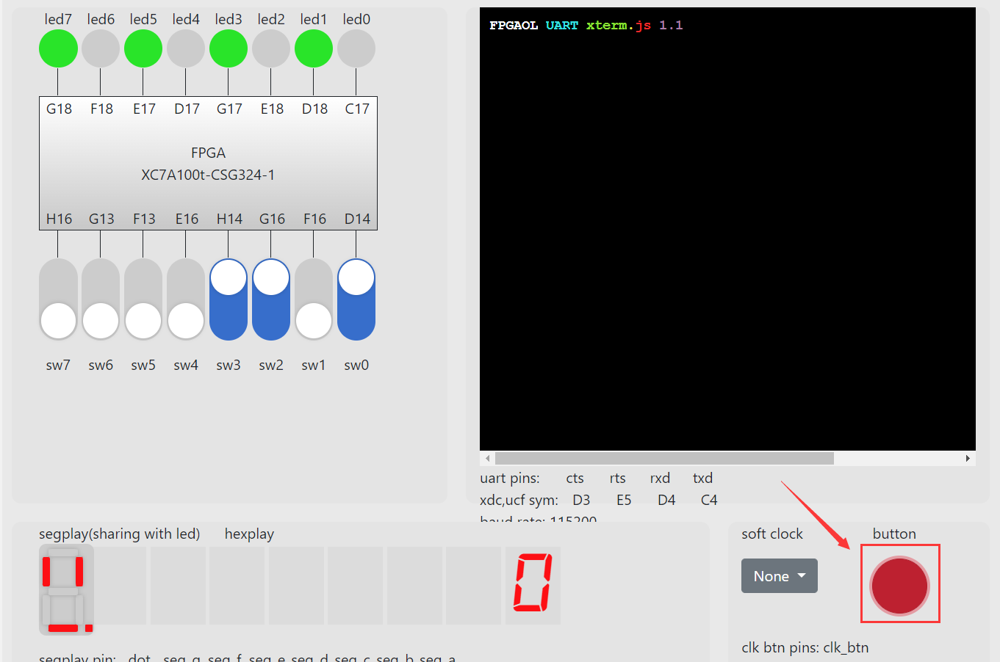

​		至此，button功能介绍完毕。

​		实际应用时可以根据自己的设计合理使用button按钮。
