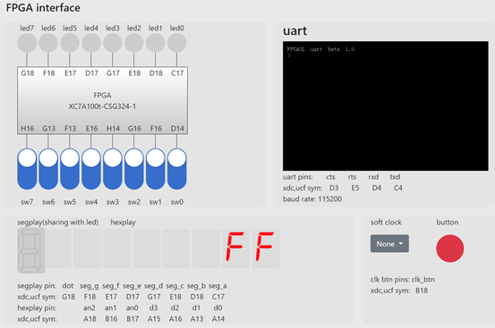

# FPGAOL实例实验——数码管的使用


## 实验目的

- 学习使用七段数码管segplay
- 学习使用计数器进行时钟分频
- 学习时钟管理单元IP核
- 学习使用数码管hexplay

## 实验过程

### Step1. 数码管介绍

​		数码管本质上是由 8 个 LED（发光二极管）构成，发光二极管的阴极共同连接到一端，并接到地，8 个阳极分别由 FPGA的 8 个输出管脚控制，当输出管脚为高电平时，对应的 LED 亮起。通过控制 8 个 LED 的亮灭，便能显示出不同的字符，例如，当 A~F 6 个LED 亮G、DP 两个 LED 不亮时，显示的便是字符“0”。


​		因平台可用的 FPGA 管脚数量有限，我们对七段数码管与 LED 的管脚进行了复用。如下图所示，两者管脚相同。因此在led灯显示发生变化时，segplay的显示也会发生相应的变化。


​		平台包含一个 8 位的十六进制数码管，该数码管共用 4bit 位宽的数据位，同时由 3bit 的选择位经译码后生成 8 个选择信号，控制 8个数码管的使能，数据位个选择位信号都是高电平有效。其工作原理如下图所示。


### Step2. 使用计数器进行时钟分频

​		前面已经讲到，FPGA 开发板的 FPGA 芯片 E3 管脚连接了一个100MHz 频率的时钟晶振，可用作时序逻辑电路的时钟信号。如果我 们需要一个其它频率的时钟信号，例如 10MHz，应该怎么办呢？一般的做法是通过计数器产生一个低频的脉冲信号，然后再将该脉冲信号控制其他逻辑的控制信号，如下代码所示，通过 pulse_10mhz 信号控制 led 信号。代码如下：

```verilog
module pulse_10mhz(
	input clk,rst,
	output reg led
);
	reg [3:0] cnt;
	wire pulse_10mhz;
	always(@posedge clk)
	begin
		if(rst)
			cnt <= 4'b0;
		else if(cnt >= 9)
			cnt <= 4'b0;
		else
			cnt <= cnt + 4'b1;
	end
	assign pulse_10mhz = (cnt == 4'h1)
	always@(posedge clk)
	begin
		if(rst)
			led <= 1'b0;
		else if(pulse_10mhz)
			led <= ~led;
	end
	endmodule
```

​		此时，我们就可以让led以分频得到的pulse_10mhz进行闪烁，波形图如下：


### Step3. 使用时钟管理IP核

​		如果设计中需要不同频率的时钟信号，还可以通过时钟管理单元IP核生成。首先，点击"IP catalog"， 在对应窗口中选中"Clocking Wizard"，并双击。


​		在弹出的窗口中，对其进行设置，输入时钟频率设置为100MHz，输出时钟有两个，分别为10MHz和200MHz。


​		设置完成后点击确认按钮，生成IP核。生成的 IP 文件可在“工程目录/工程名.srcs/sources_1/ip/IP 核名称/IP 核名称.v”找到。用户可在设计文件中像调用其它模块一样使用该 IP 核,使用时只需要了解 IP 核的功能及端口信号的含义及时序，而不用关心模块内部的具体实现。接下来，我们分别使用这两个时钟模块进行计数：

```verilog
module test_cnt(
input               clk,
input               rst,
output      [7:0]   led);
wire        clk_10m,clk_200m,locked;
reg  [31:0] cnt_1,cnt_2;
always@(posedge clk_200m)
begin
    if(~locked)
        cnt_1 <= 32'hAAAA_AAAA;
    else
        cnt_1 <= cnt_1+1'b1;;
end
always@(posedge clk_10m)
begin
    if(~locked)
        cnt_2 <= 32'hAAAA_AAAA;
    else
        cnt_2 <= cnt_2+1'b1;;
end
assign  led = {cnt_1[27:24],cnt_2[27:24]};
clk_wiz_0   clk_wiz_0_inst(
.clk_in1    (clk),
.clk_out1   (clk_10m),
.clk_out2   (clk_200m),
.reset      (rst),
.locked     (locked));
endmodule
```

​		我们使用仿真功能模拟波形图，观察差异，仿真代码如下：

```verilog
`timescale 1ns / 1ps
module tb(  );
reg clk,rst;
initial
begin
    clk = 0;
    forever
    #5 clk = ~clk;
end
initial
begin
    rst = 1;
    #100 rst = 0;
end
lab07_cnt    test(
.clk    (clk),
.rst    (rst),
.led    ( ));
endmodule
```

​		得到的仿真波形图如下：


​		接下去烧写bit的工作与之前相同，在这里不展开。

### Step4. 使用数码管hexplay

​		为了使数码管显示正常，我们首先需要降低数码管的时钟频率，也就是上述的时钟分频。理论上两种方法都可以使用。

​		接下来我们会举一个简单的例子示范如何使用数码管。

​		采用 8 个开关作为输入，两个十六进制数码管作为输出，采用时分复用的方式将开关的十六进制数值在两个数码管上显示出来，例如高四位全为 1，低四位全为 0 时，数码管显示“F0”。

​		首先建立工程。这与前几个实验相同，在此不再赘述。

​		设计代码如下：

```verilog
module test(
	input clk,
	input [7:0] sw,
    input reg [2:0] an,    //3位的an用于选择八位数码管中的某一个
	output reg [3:0] data);
    reg ctrl;
    reg [20:0] cnt;
    wire clk_100hz;
    always@(posedge clk)
    begin
        if(cnt >= 99_9999)
            cnt <= 0;
       	else
            cnt <= cnt + 1;
    end
    assign clk_100hz = (cnt == 1);
    always@(posedge clk_100hz)
    begin
    	ctrl = ~ctrl;
        if(ctrl == 1)
        begin
        	an <= 3'b000;
            data <= sw[3:0];
        end
        else
        begin
        	an <= 3'b001;
            data <= sw[7:4];
        end
    end
endmodule
```

​		上述代码中，将sw[7:4]设计为高位，sw[3:0]设计为地位，并通过an控制当前显示的是哪一个数码管。通过使用适当的时钟频率，多个数码管可以一起正常显示。

​		接下来，完成约束文件。我们可以看到，FPGAOL给出的样例文件中，Hexplay部分代码如下：

```verilog
## FPGAOL HEXPLAY

#set_property -dict { PACKAGE_PIN A14   IOSTANDARD LVCMOS33 } [get_ports { hexplay_data[0] }];
#set_property -dict { PACKAGE_PIN A13   IOSTANDARD LVCMOS33 } [get_ports { hexplay_data[1] }];
#set_property -dict { PACKAGE_PIN A16   IOSTANDARD LVCMOS33 } [get_ports { hexplay_data[2] }];
#set_property -dict { PACKAGE_PIN A15   IOSTANDARD LVCMOS33 } [get_ports { hexplay_data[3] }];
#set_property -dict { PACKAGE_PIN B17   IOSTANDARD LVCMOS33 } [get_ports { hexplay_an[0] }];
#set_property -dict { PACKAGE_PIN B16   IOSTANDARD LVCMOS33 } [get_ports { hexplay_an[1] }];
#set_property -dict { PACKAGE_PIN A18   IOSTANDARD LVCMOS33 } [get_ports { hexplay_an[2] }];
```

​		其中前四位表示一个十六进制的数，由一个数码管显示。后三位通过三八译码器选择八个数码管中哪一个数码管显示当前的数据。

​		这里直接给出约束文件代码：

```verilog
## Clock signal
set_property -dict { PACKAGE_PIN E3    IOSTANDARD LVCMOS33 } [get_ports { CLK100MHZ }]; #IO_L12P_T1_MRCC_35 Sch=clk100mhz
#create_clock -add -name sys_clk_pin -period 10.00 -waveform {0 5} [get_ports {CLK100MHZ}];

## FPGAOL SWITCH

set_property -dict { PACKAGE_PIN D14   IOSTANDARD LVCMOS33 } [get_ports { sw[0] }];
set_property -dict { PACKAGE_PIN F16   IOSTANDARD LVCMOS33 } [get_ports { sw[1] }];
set_property -dict { PACKAGE_PIN G16   IOSTANDARD LVCMOS33 } [get_ports { sw[2] }];
set_property -dict { PACKAGE_PIN H14   IOSTANDARD LVCMOS33 } [get_ports { sw[3] }];
set_property -dict { PACKAGE_PIN E16   IOSTANDARD LVCMOS33 } [get_ports { sw[4] }];
set_property -dict { PACKAGE_PIN F13   IOSTANDARD LVCMOS33 } [get_ports { sw[5] }];
set_property -dict { PACKAGE_PIN G13   IOSTANDARD LVCMOS33 } [get_ports { sw[6] }];
set_property -dict { PACKAGE_PIN H16   IOSTANDARD LVCMOS33 } [get_ports { sw[7] }];


## FPGAOL HEXPLAY

set_property -dict { PACKAGE_PIN A14   IOSTANDARD LVCMOS33 } [get_ports { hexplay_data[0] }];
set_property -dict { PACKAGE_PIN A13   IOSTANDARD LVCMOS33 } [get_ports { hexplay_data[1] }];
set_property -dict { PACKAGE_PIN A16   IOSTANDARD LVCMOS33 } [get_ports { hexplay_data[2] }];
set_property -dict { PACKAGE_PIN A15   IOSTANDARD LVCMOS33 } [get_ports { hexplay_data[3] }];
set_property -dict { PACKAGE_PIN B17   IOSTANDARD LVCMOS33 } [get_ports { hexplay_an[0] }];
set_property -dict { PACKAGE_PIN B16   IOSTANDARD LVCMOS33 } [get_ports { hexplay_an[1] }];
set_property -dict { PACKAGE_PIN A18   IOSTANDARD LVCMOS33 } [get_ports { hexplay_an[2] }];
```

​		完成代码和约束文件输入后，保存工程，并点击“Generate  Bitstream”，Vivado 工具会自动完成综合、实现、布局布线等过程， 并最终生成 bit 文件，生成的 bit 文件一般存放在“工程目录/工程 名.runs/impl_1/”内。选择“取消”按钮关闭弹出的对话框。

​		在FPGAOL平台上烧写刚刚生成的bit文件，以下进行结果的一些展示：

当输入全为0时，显示00：


当输入为0000_0001时，显示01：


依次类推，当输入为1111_0000时，显示为F0：


当输入为1111_1111时，显示为FF：



展示完毕。