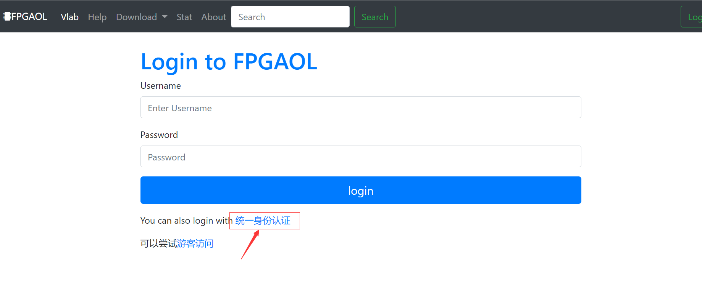

## 最快上手---最快烧写流程

> 需要用平台的fpgaol1.xdc文件作为约束文件生成比特流

#### 登录

首先进入[Vlab实验中心][1]；

然后点击**FPGA在线**按钮，进入[FPGA登录界面][2]；

如果你是中国科学技术大学学生，只需点击**统一身份认证**，输入自己的学号和密码即可；

!

也可以通过**游客访问**或已获得的**用户名和密码**进行登录。

笔者使用的是**统一身份认证**，输入正确的学号、密码后，进入FPGA申请节点的页面

[1]: https://vlab.ustc.edu.cn/	" Vlab实验中心"
[2]: https://fpgaol.ustc.edu.cn/accounts/login/?next=/fpga/usage/	" FPGA登录界面"

#### acquire

在FPGA申请节点的页面中，1、2行分别是第一、第二代FPGA；

每一列的名称是（从左到右）**设备类型**、**可用/总共节点数目**、**FPGA使用说明**、**FPGA默认xdc文件**、**节点使用**;

在节点使用那一列，有两个按钮，分别是**获取**、**释放**；**获取**可以申请一个节点、**释放**会将已申请的节点释放掉;

如果我们要申请一个节点，只需点击**acquire**即可，然后下面会出现你申请的节点信息，设备ID、获取时间、默认释放时间、节点链接;

点击该链接后，进入**节点页面**，如下：

#### 选择文件

在节点页面的左上角有**选择文件**按钮，点击后会弹出文件目录，即可选择文件；

>注意：可选择的文件是在vivado中生成的bit文件

点击文件后，发现右上角**Program**按钮旁边的文件路径已经出现了你刚刚选择的文件，然后点击**Program**按钮即可

点击**Program**按钮后，如果出现该页面，表明烧写成功

如果是其它异常情况，可以刷新页面、重新选择文件、再次烧写或者回到节点申请页面，将该节点释放，再申请一个节点，重新进行烧写。

#### 烧写完成，拨动开关

烧写完成后，根据xdc文件中的管脚对应关系，就可在下面的**FPGA interface**中进行测试了。

