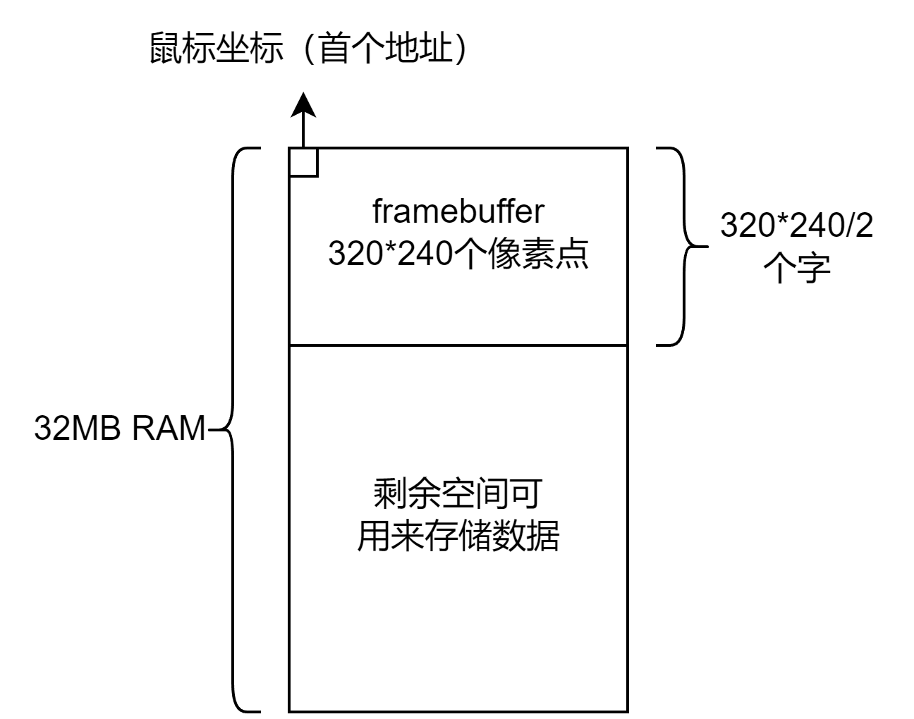

# zynq使用说明

此文档是FPGAOL上对zynq设备的烧写使用说明

zynq上Artix-7芯片的型号为：xc7a35tfgg484-1

目前支持七种外设：LED灯, 开关，按钮，数码管，串口，帧缓冲显示器，鼠标

## LED灯和开关


管脚的对应关系为：

|  SW  |  0   |  1   |  2   |  3   |  4   |  5   |  6   |  7   |
| :--: | :--: | :--: | :--: | :--: | :--: | :--: | :--: | :--: |
| 管脚 | B17  | B18  | D17  | C17  | C18  | C19  | E19  | D19  |

| LED  |  0   |  1   |  2   |  3   |  4   |  5   |  6   |  7   |
| :--: | :--: | :--: | :--: | :--: | :--: | :--: | :--: | :--: |
| 管脚 | B15  | B16  | C13  | B13  | A15  | A16  | A13  | A14  |

示例代码如下：

```verilog
module echo (
	input [7:0] sw,
	output [7:0] led
);
assign led = sw;
endmodule
```

## 七段数码管


数码管分为hex_play和seg_play两部分，实验时我们主要用到的是hex_play。

### hex_play

由于FPGAOL上的管脚数量有限，我们对数码管进行了一定的**简化**：在使能方面，不再通过8个管脚分别使能8个数位，而是仅使能由`AN[3:0]`所表示的二进制数所对应的数位；在显示的数字方面，不再通过`SEG`信号独立控制每个段（segment），而是直接显示`D[3:0]`形成的16进制数。**例如**，若`AN=3'b010, D=4'b1010`，则在下标为2的数位上显示`A`。

除此之外，数码管的使用方式与现实中无异。和现实中的数码管一样，我们建议的扫描频率为**50Hz**，也就是说，若要驱动8个数码管，需要一个**400Hz**的时钟。

数码管与FPGA上管脚的对应关系如下：

|  D0  |  D1  |  D2  |  D3  | AN0  | AN1  | AN2  |
| :--: | :--: | :--: | :--: | :--: | :--: | :--: |
| F18  | E18  | B20  | A20  | A18  | A19  | F19  |

在此简要说明七段数码管的显示方式。现实中的七段数码管是通过快速的扫描，利用人眼的视觉延迟来实现在不同的数位上显示不同的数字的，但在网页上，这显然不可能。于是在新版本的FPGAOL中，我们先对采集到的数码管控制信号进行预处理，按照七段数码管的显示原理计算出每个数位上显示的数字，并直接在网页上显示。

具体来讲，确定数码管每一位所显示数字的算法大致为：

```
while true:
  sleep(0.1)    // 每隔0.1秒刷新一次
  for i=0 to 7:
    for j=0 to 15:
      T[i][j] = 过去0.1秒内，AN为i且D为j的总时长
    max_j = index_of_max(T[i])  // 选择在第i位上被显示时间最长的数字
    display `max_j` on `i`
```

### seg_play

为了弥补hex_play不能按段来显示数字的缺陷，我们提供了seg_play，它是支持通过段来控制的一位数码管。为了节约管脚，它的控制信号是与LED共享的，可以通过LED的信号来控制它，具体的对应关系如下：


| 数码管 |  A   |  B   |  C   |  D   |  E   |  F   |  G   | 小数点 |
| :----: | :--: | :--: | :--: | :--: | :--: | :--: | :--: | :----: |
|  LED   |  0   |  1   |  2   |  3   |  4   |  5   |  6   |   7    |

示例代码如下：(七段数码管的[示例程序](./seg)是一个以秒为单位的16进制计时器，当SW0为0时该计时器递增，反之则递减。)

```verilog
module top(
	input CLK100MHZ,
	input sw0,
	output reg [2:0] hexplay_an,
	output reg [3:0] hexplay_data
);


reg [31:0] data;
reg [32:0] hexplay_cnt;

always@(posedge CLK100MHZ) begin
	if (hexplay_cnt >= (2000000 / 8))
		hexplay_cnt <= 0;
	else
		hexplay_cnt <= hexplay_cnt + 1;
end

always@(posedge CLK100MHZ) begin
	if (hexplay_cnt == 0)begin
		if (hexplay_an == 7)
			hexplay_an <= 0;
		else
			hexplay_an <= hexplay_an + 1;
	end
end

always@(*) begin
	case(hexplay_an)
		0: hexplay_data = data[3:0];
		1: hexplay_data = data[7:4];
		2: hexplay_data = data[11:8];
		3: hexplay_data = data[15:12];
		4: hexplay_data = data[19:16];
		5: hexplay_data = data[23:20];
		6: hexplay_data = data[27:24];
		7: hexplay_data = data[31:28];
	endcase
end

reg [26:0] timer_cnt;
always@(posedge CLK100MHZ) begin
	if (timer_cnt >= 100000000)
		timer_cnt <= 0;
	else
		timer_cnt <= timer_cnt + 1;
end

always@(posedge CLK100MHZ) begin
	if (timer_cnt == 0) begin
        if (sw0) begin
			data <= data - 1;
		end
		else begin
			data <= data + 1;
		end
	end
end

endmodule
```

## 按钮


页面提供一个按钮，对应管脚为F20，该按钮**按下时为高电平，松开时为低电平**

示例程序：

```verilog
module example(
    input clk,
    input btn
    );
reg clear;
reg btn_prev;
always @(posedge clk) begin
    btn_prev <= btn;  
    if (!btn_prev && btn) 
        clear <= 1'b1;  
    else
        clear <= 1'b0;  
end
endmodule
```

## UART


串口的rxd管脚为F15, txd管脚为F13

波特率为9600

输入方式有两种

1. 直接在串口终端里面输入，输入的每一个字符都会逐个通过串口发送，不会自动回显，页面只会显示通过串口接收到的信息
2. 在输入框输入将要发送的字符串，然后点击input按钮将所有字符串一起通过串口发送，发送后不会清除输入框中的内容

示例代码：

```verilog
module example(
    input rxd,
    output txd
    );
assign txd = rxd;
endmodule
```

## 帧缓冲显示器



**原理：**我们基于一个称为**帧缓冲区**（Framebuffer）的内存区域来存储像素数据，然后显示器从这个帧缓冲区读取数据并在屏幕上显示图像

如上图，我们总共有32MB的内存区域，地址范围为0x00000000到0x01FFFFFF，按字节寻址。

其中，地址0x00000000-0x000257FF范围内的空间被用来存储像素数据，然后作为framebuffer在显示区域显示图像

framebuffer有320*240个像素点，图像宽为320，高为240，每个像素点由2个字节组成，即16bit数据。像素的表示为RGB565格式，具体如下图所示：


每个像素点在内存中的字节序应为小端序，即像素数据的高位字节放在高位地址，示例如下：

对于红色像素，16bit数据为 11111000 00000000，即F800,  那么在内存中应存储为00F8, 即低位地址为00，高位地址为F8

访问地址按字对齐，每个地址读出的数据为32bit，包含两个像素点数据，目前一次同时读写两个像素点数据

#### 共享内存的读写


我们通过一个同步存储器来对共享内存进行读写，模块已经封装成一个pspi_host.v文件，通过使用这个模块来对共享内存进行读取，以下是参数说明：

PSPI_WIDTH 为内部通信串口的传输宽度，固定为一位，初始化时需设置为1

clk为时钟信号，rst为复位信号


addr, data, we, rd, ready, spo为对内存读写的主要控制信号

addr表示要读取或者写入内存数据的地址，按字节寻址

data表示待写入内存的数据，32位

rd表示读取请求，当ready为1的时候可以发出，表示对当前addr地址请求读取数据，只需要使能1个时钟周期即可关闭

we表示写入请求，当ready为1的时候可以发出，表示对当前addr地址请求写入数据data，只需要使能1个时钟周期即可关闭

ready表示读取或写入完成，此时可以接受新的读写信号

spo表示读取出来的数据，当ready为1时，spo表示上次rd请求对应的地址里面读取的数据


miso, sck, mosi是内部通信串口的控制信号，只需要连接上对应的管脚即可，不需要额外的操作

管脚对应关系如下：

| sck  | miso | mosi |
| :--: | :--: | :--: |
| E17  | C15  | C14  |

## 鼠标


共享内存的第一个地址记录了鼠标的坐标，即地址0x00000000为鼠标的坐标数据，32位

当鼠标在上图所示区域或者framebuffer区域内点击或按住滑动时，鼠标的坐标位置会实时更新到共享内存中，触摸屏也可支持。

鼠标的坐标为x,y，以对应区域左上角为原点，水平坐标为x, 垂直坐标为y，坐标值以16bit数据保存，高位为x, 低位为y，以小端字节序存储，示例如下：

对于坐标x=298, y=56, 对应的16进制为x=0x012a, y=0x0038, 那么此32位数据为0x012a0038，然后以小端字节序存储在共享内存首位，存储为0x38002a01

framebuffer和鼠标的示例代码如下, 此例程为通过鼠标在framebuffer区域进行绘画：

```verilog
module example(
    input clk,
    input sw0,
    output sck,
	output mosi,
	input miso
    );
    
parameter PSPI_WIDTH = 1;
parameter YELLOW = 16'hE0FF;  // 黄色RGB565格式
parameter RED = 16'h00F8;     // 红色RGB565格式
parameter YELLOW32 = 32'hE0FFE0FF;  // 两像素黄色RGB565格式
parameter RED32 = 32'h00F800F8;     // 两像素红色RGB565格式
    
reg [31:0] pspi_a;
reg [31:0] pspi_d;
reg pspi_we;
reg pspi_rd;
wire [31:0] pspi_spo;
wire pspi_ready;

reg write_in_progress = 0;   // 标志当前是否在写入过程
reg read_in_progress = 0;

wire [31:0] mouse_xy;
reg [31:0] mouse_data;
wire [15:0] mouse_x, mouse_y;
wire [31:0] mouse_addr;

assign mouse_xy = {pspi_spo[7:0], pspi_spo[15:8], pspi_spo[23:16], pspi_spo[31:24]};
assign mouse_x = mouse_xy[31:16];
assign mouse_y = mouse_xy[15:0];
assign mouse_addr = (mouse_y * 320 + mouse_x) * 2;
    
// 状态机控制读取和写入
always @(posedge clk) begin
    if (sw0) begin
        pspi_we <= 0;
        pspi_rd <= 0;
        write_in_progress <= 0;
        read_in_progress <= 0;
    end else begin
        // 读取第0地址的鼠标数据
        if (!read_in_progress && !write_in_progress && !pspi_we && !pspi_rd) begin
            pspi_a <= 32'd0;  // 读取第0地址
            pspi_rd <= 1'b1;  // 触发读取信号
            read_in_progress <= 1'b1; // 开始读取流程
        end 
        else if (read_in_progress) begin
            pspi_rd <= 1'b0;
            if (read_in_progress && pspi_ready) begin
                read_in_progress <= 0;
                if (mouse_xy != mouse_data) begin
                    mouse_data <= mouse_xy;
                    write_in_progress <= 1'b1;  // 启动写入流程
                    pspi_a <= mouse_addr;
                    pspi_d <= RED32;
                    pspi_we <= 1'b1;
                end
            end
        end
        else if (write_in_progress) begin
            pspi_we <= 1'b0;
            // 写入RED32数据到目标地址
            if (write_in_progress && pspi_ready) begin
                write_in_progress <= 1'b0; // 写入完成
            end
        end
    end
end

pspi_host #(.PSPI_WIDTH(PSPI_WIDTH)) pspi_host_inst (
		.clk(clk),
		.rst(clear),

		.a(pspi_a),
		.d(pspi_d),
		.we(pspi_we),
		.rd(pspi_rd),
		.spo(pspi_spo),
		.ready(pspi_ready),

		.sck(sck),
		.mosi(mosi),
		.miso(miso)
	);

endmodule
```

## 共享内存二进制文件写入


用户可在此处把二进制存储数据写入共享内存，最多不超过32MB，二进制文件会从地址0处开始覆盖共享内存中的内容，用户可按照framebuffer中的格式要求，自行制作需要的二进制文件。

以下是一个python示例代码，展示了如何将一个320*240的图片转换成相对应的二进制文件

```python
from PIL import Image
import struct

# Open the image file (assuming it's a 320x240 image)
image_path = "FPGA.png"
img = Image.open(image_path)

# Ensure the image is in RGB mode
img = img.convert('RGB')

# Prepare the binary data
binary_data = bytearray()

# Convert each pixel to RGB565 format (16 bits) and store in big-endian order
for y in range(img.height):
    for x in range(img.width):
        r, g, b = img.getpixel((x, y))

        # Convert 8-bit RGB to 16-bit RGB565
        r5 = (r >> 3) & 0x1F  # 5 bits for red
        g6 = (g >> 2) & 0x3F  # 6 bits for green
        b5 = (b >> 3) & 0x1F  # 5 bits for blue
        rgb565 = (r5 << 11) | (g6 << 5) | b5

        # Convert to small-endian and append to binary data
        binary_data.extend(struct.pack('<H', rgb565))

# Save the binary data to a file
output_file = "output_image_rgb565.bin"
with open(output_file, 'wb') as f:
    f.write(binary_data)
```
