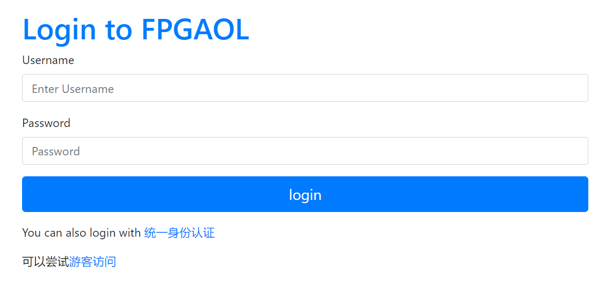

# fpgaol项目文档

仓库：[cyh / fpgaol · GitLab (ustc.edu.cn)](https://git.lug.ustc.edu.cn/cyh/fpgaol)

项目所在位置：202.38.79.134:~/fpgaol

## 项目概览

此项目是用来管理和分发一代与二代节点的页面

通过**https://fpgaol.ustc.edu.cn**来访问

项目基于django搭建而成

文件树如下：

```
.
├── fpga					对fpga的管理
│   ├── admin.py
│   ├── apps.py
│   ├── device_manager.py	设备管理文件，为重点文件
│   ├── __init__.py
│   ├── models.py			数据库模型
│   ├── routing.py
│   ├── static
│   ├── stat.py
│   ├── templates			节点分配页面html
│   ├── tests.py
│   ├── urls.py				fpga url管理
│   └── views.py			fpga管理视图，重点文件
├── fpgaol					项目主app,管理注册登录
│   ├── asgi.py
│   ├── backends.py
│   ├── __init__.py
│   ├── routing.py
│   ├── settings.py			项目配置文件
│   ├── urls.py				url管理
│   ├── views.py			登录注册视图，重点文件
│   └── wsgi.py
├── homepage				提交实验报告的app，可忽略
├── manage.py				项目入口，manage.py文件
├── README.md				项目readme
├── static					静态资源
├── templates				模板，里面是登录注册的html
│   ├── 403.html
│   └── registration
```

项目主要包含两个app

- **fpgaol**	入口app，管理注册与登录
- **fpga**       对设备节点进行管理

## 项目运行

#### **一般运行方式（后面是ip+端口）**

```
python3 manage.py runserver 202.38.79.134:80
```

**本服务器采用daphne来启动服务，并利用supervisor来进行管理**

#### **daphne手动启动方式**（启动目录为~/fpgaol/fpgaol）

```
daphne fpgaol.asgi:application -b localhost -p 8000
```

#### **supervisor启动方式**(配置好的项目用此方式)

```
sudo supervisorctl restart all
```

supervisor配置文件位于

```
/etc/supervisor/conf.d/fpgaol.conf
```

#### nginx配置

此配置还需要搭配nginx进行使用（已配置好就不需要再配置了）

nginx配置文件位于

```
/etc/nginx/sites-available/fpgaol_nginx.conf
```

为使其生效，需在/etc/nginx/sites-enable/中创建软链接,sites-enable中输入如下命令

```
sudo ln -s /etc/nginx/site-available/fpgaol_nginx.conf
```

即可看到sites-enable中也生成了一个fpgaol_nginx.conf

#### 说明：

supervisor调用daphne启动django项目，并运行于localhost:8000上

nginx监听80端口，并将请求发送给localhost:8000来处理

## 登录功能



#### 用户密码登录

没有开放注册入口，统一身份认证第一次登录后会生成一个用户，用户名为学号，默认密码为"qazwsx"

用这组用户名和密码即可登录

另外还可以通过以下命令创建超级用户，以登录管理后台

```javascript
python3 manage.py createsuperuser
```

#### 统一身份认证登录

调用如下的链接即可，service后面是需要跳转的页面

https://passport.ustc.edu.cn/login?service=https://fpgaol.ustc.edu.cn/accounts/login_with_ticket/

#### 游客登录

系统有20个测试用户，用户名为test1-test20,密码为testuser

游客登录即用测试用户来进行登录

### 登录要求

对于需要登录才能访问的页面，直接在views.py对应的函数上面添加装饰器 **@login_required** 即可实现登录要求功能

## 可用节点统计

通过访问 http://192.168.1.xxx:8080/alive来判断节点是否可用

开启monitor_fn可以实现实时监控可用节点数

## 节点请求及token

当要申请一个节点时，访问 **http://192.168.1.xxx:8080/set/?token=%s** 来设置token，%s是服务器自动生成的一串字符串

即访问set即可设置token，同时在申请同时设置了节点有效期限，默认十分钟

当期限达到时访问 **http://192.168.1.xxx:8080/unset/** 来消除token，树莓派端会将token重置为默认token，这样原先的token就无效了

默认token为 **token_debug_ignore** ,即访问 http://202.38.79.134:12xxx/?token=token_debug_ignore 即可永久使用一个节点

## 节点管理

需要有管理权限，要么登录管理账户，要么创建超级用户，要么用管理账户给普通用户授予管理权限

登入管理账户后，访问 http://fpgaol.ustc.edu.cn/admin 即可进入管理视图

访问 http://fpgaol.ustc.edu.cn/fpga/list 即可查看节点的使用情况

